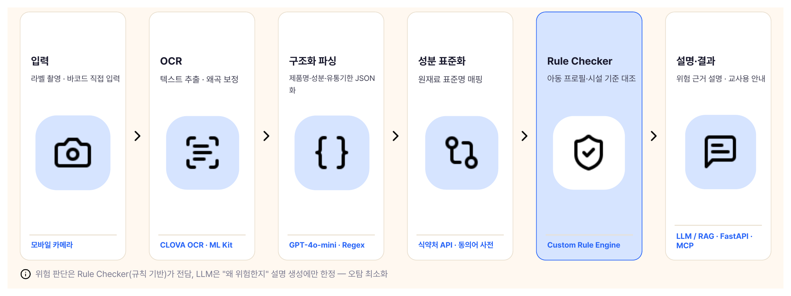

<div align="center">


# 딱콕 (Ddakkok) — Backend

> **SSAFY × Kakao Tech Bootcamp AI Hackathon**<br>
> 🏆 **대한상공회의소회장상** 수상<br>
> 팀 **땅콩 (peanut-works)** · 2026.06.13 ~ 2026.06.14

**영유아 보육시설을 위한 AI 제품 안전 관리 서비스**

아동별 건강 데이터에 *딱* 맞게, 위험 성분만 *콕* 집어줍니다.

<br>


</div>

---

## 한눈에 보기

어린이집·유치원 교사는 물티슈, 간식, 위생용품 같은 제품을 매일 아이들에게 사용합니다. 하지만 제품 라벨의 깨알 같은 성분표를 아이마다 다른 알러지·건강 정보와 일일이 대조하기는 현실적으로 어렵습니다.

**딱콕**은 이 과정을 자동화합니다. 교사가 제품 라벨을 촬영하면, 추출된 성분을 반 아이들의 건강 프로필과 대조해 **사용해도 되는지(PASS) / 주의해야 하는지(WARN) / 사용하면 안 되는지(FAIL)** 를 즉시 알려주고, 그 판단 근거를 교사가 이해하기 쉬운 문장으로 설명해 줍니다.

이 레포지토리는 그 핵심 로직을 담당하는 **FastAPI 백엔드**입니다.

> 보육 교사 102명 설문 결과, **전원이** 제품 성분 점검에 불편을 겪은 적이 있다고 답했습니다.
> 가장 큰 이유는 *관리 시스템의 부재(82건)* 와 *점검 시간 부족(57건)*. 알레르기 질환 보유 영유아가 다니는 기관은 **56.5%** 에 달하지만, 알레르기 교육을 이수한 교사는 **35.2%** 에 그칩니다.

---

## 주요 기능

- **인증** — mock token 기반 인증으로 빠른 API 테스트
- **라벨 파싱** — OCR 텍스트 → 제품명 / 성분 / 제조사 / 유통기한 구조화
- **제품 관리** — 제품 등록 · 목록 · 상세 · 바코드 조회
- **아동 프로필** — 반별 아동 목록 및 알러지·건강 정보 조회
- **안전 검사** — 제품 성분 × 아동 프로필 대조로 PASS/WARN/FAIL 판정
- **교사용 설명** — 검사 결과를 자연어 설명으로 변환 (RAG 기반)
- **리콜 알림** — 식약처 리콜 공지 조회 (전체 공개 + 시설 한정)
- **대시보드** — 홈 화면용 요약 정보 제공

---

## AI 파이프라인

딱콕의 핵심은 **규칙 기반 판정**과 **LLM 설명 생성**을 분리한 파이프라인입니다. 판정은 규칙 엔진(Rule Checker)이 전담하므로 LLM 환각에 의한 오탐이 없고, LLM은 그 결과를 교사용 문장으로 다듬는 역할만 합니다.



| 단계 | 역할 | 사용 기술 |
| --- | --- | --- |
| **OCR** | 라벨 이미지 → 텍스트 | ML Kit(온디바이스) → 이미지 보정 → CLOVA OCR |
| **NER** | 텍스트 → `{제품명, 성분[], 유통기한, 제조사}` JSON | GPT-4o-mini Function Calling |
| **Rule Checker** | 성분·유통기한 × 아동 프로필 대조 판정 | 규칙 기반 엔진 (LLM 미사용) |
| **RAG** | 식약처 고시·안전 기준 검색 | sentence-transformers + pgvector |
| **LLM** | 판정 결과 → 교사용 설명 문장 | GPT-4o-mini (+ RAG 컨텍스트) |

> 외부 AI/OCR key 없이도 `AI_PROVIDER=mock`, `OCR_PROVIDER=mock` 으로 전체 흐름을 체험할 수 있습니다.

---

## 설계 근거

영유아 안전이 걸린 도메인인 만큼, **"빠르고 그럴듯한" 것보다 "느려도 틀리지 않는" 것**을 우선했습니다. 핵심 선택 두 가지를 실측으로 검증했습니다.

**1. OCR은 CLOVA — 한국어 라벨 인식 정확도**

구겨지고 흐릿한 실제 보육 현장의 라벨 이미지 기준 성분 인식 정확도입니다.

| OCR 엔진 | 성분 인식 정확도 |
| --- | :---: |
| **CLOVA** | **98.8%** |
| EasyOCR | 52.9% |
| PaddleOCR | 45.1% |

**2. 판정은 Rule Checker — LLM 단독 대비**

판정을 LLM에 맡기지 않고 규칙 엔진이 전담하는 이유입니다. **거짓음성(위험을 안전으로 오판) 0%** 가 핵심입니다.

| 항목 | Rule Checker | LLM 단독 |
| --- | :---: | :---: |
| 정확도 | **94%** | 78% |
| 거짓음성 | **0%** | 9% |
| 속도 · 비용 | **0.04ms · 무료** | ~1,600ms · 유료 |

---

## 기술 스택

| 구분 | 사용 기술 |
| --- | --- |
| **Backend** | FastAPI · Python 3.12 |
| **Database** | PostgreSQL + pgvector |
| **ORM / Migration** | SQLAlchemy 2.0 · Alembic |
| **Package / Run** | uv |
| **Container** | Docker Compose |
| **AI / OCR** | OpenAI · GMS · Groq provider · CLOVA OCR · RuleChecker |
| **Quality** | pytest · ruff · mypy |

---

## 빠른 시작

```bash
# 1. 환경 변수 준비 (외부 key 없이 mock으로 바로 실행 가능)
cp .env.example .env

# 2. 컨테이너 빌드 및 실행
docker compose up -d --build

# 3. DB 마이그레이션
docker compose exec backend uv run --no-sync alembic upgrade head

# 4. 초기 데이터 시드
docker compose exec backend uv run --no-sync python scripts/seed.py
```

실행 후 [http://localhost:8000/docs](http://localhost:8000/docs) 에서 Swagger 문서를 확인할 수 있습니다.
환경 변수 전체 목록과 기본값은 `.env.example` 을 참고하세요.

<details>
<summary>서버 종료 / DB 초기화</summary>

```bash
docker compose down       # 서버 종료
docker compose down -v     # DB까지 초기화
```

</details>

### 개발용 테스트 계정

| 항목 | 값 |
| --- | --- |
| email | `teacher@ddakkok.com` |
| password | `ddakkok1234` |
| token | `mock-token:user:1` |

---

## API 흐름

클라이언트 연동 기준 대표 흐름입니다.

```text
POST /api/products/parse-label-text     # 라벨 텍스트 파싱
  → POST /api/products                  # 제품 저장
  → GET  /api/classrooms/{id}/children  # 반 아동 조회
  → POST /api/safety-checks             # 안전 검사 생성
  → GET  /api/safety-checks             # 검사 목록
  → GET  /api/safety-checks/{id}        # 검사 상세
  → POST /api/safety-checks/{id}/explanations  # 교사용 설명 생성
```

<details>
<summary>요청 예시 보기</summary>

**제품 라벨 텍스트 파싱**

```http
POST /api/products/parse-label-text
Authorization: Bearer mock-token:user:1
```

```json
{
  "text": "제품명: 밀크 프로틴 보습 물티슈\n제조사: 해커톤생활건강\n성분: 정제수, 글리세린, 카제인Na\n유통기한: 2027.08.31",
  "category": "WET_TISSUE"
}
```

**안전 검사 생성**

```http
POST /api/safety-checks
Authorization: Bearer mock-token:user:1
```

```json
{
  "product_id": 102,
  "classroom_id": 1,
  "child_ids": [1, 2]
}
```

</details>

전체 API 명세는 서버 실행 후 Swagger UI(`/docs`)에서 확인하세요.

---

## 테스트 & 품질 검사

```bash
docker compose exec backend uv run --no-sync ruff check   # 린트
docker compose exec backend uv run --no-sync pytest       # 테스트
```

---

## 프로젝트 구조

```text
ddakkok-be/
├── main.py              # FastAPI 앱 진입점, 라우터 등록
├── app/
│   ├── api/routes/      # 라우터 (HTTP 레이어)
│   ├── core/            # 설정 · DB · 예외 처리
│   ├── models/          # SQLAlchemy ORM 모델
│   ├── schemas/         # Pydantic 요청/응답 스키마
│   ├── services/        # 비즈니스 로직
│   └── ai/              # AI 파이프라인 (OCR · NER · RuleChecker · RAG · LLM)
├── migrations/          # Alembic 마이그레이션
├── scripts/             # 시드 · 유틸 스크립트
└── tests/               # pytest 테스트
```

---

<div align="center">


**Team 땅콩 (peanut-works)**

정유정 · 손준혁 · 여성욱 · 임지영 · 이현우 · 장수철

Made with 🥜

</div>
